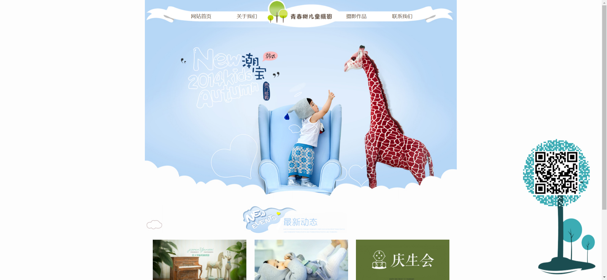
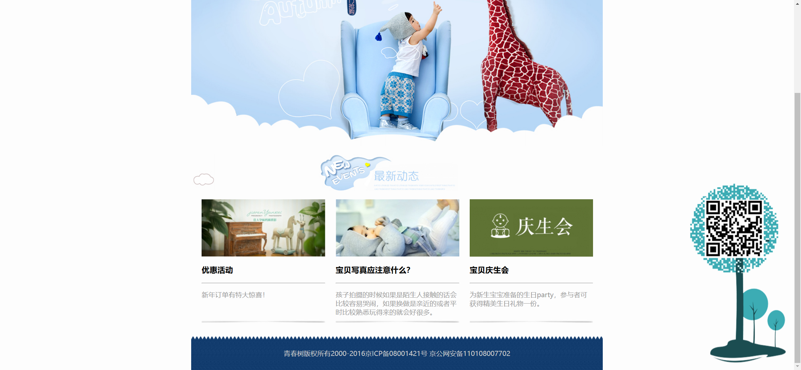

# Task Description: Re-implement the Webpage

Your job is to design a webpage that replicates the given design and functionality. The webpage is a children's photography site with various sections and interactive elements. The provided screenshots are rendered under a resolution of 1920x1080.

## Initial Webpage
The initial webpage should look like this:

## Layout and Structure

### 1. Header Section
- The header section contains a navigation bar with four links: "网站首页" (Homepage), "关于我们" (About Us), "摄影作品" (Photography Works), and "联系我们" (Contact Us).
- Use the background image `images/nav.jpg` for the navigation bar.
- Each link should have the class name `text`.

### 2. Banner Section
- The banner section should use the background image `images/bg.jpg`.

### 3. Dynamic Content Section
- This section contains an image `images/dongtai.jpg`.
- Below the image, there are three columns, each containing:
  - An image (`images/news1.jpg`, `images/news2.jpg`, `images/news3.jpg` respectively).
  - A heading.
  - A horizontal line.
  - A paragraph of text.
  - An image `images/yinying.jpg`.

#### Column Details:
- **First Column:**
  - Heading: "优惠活动"
  - Paragraph: "新年订单有特大惊喜！"
- **Second Column:**
  - Heading: "宝贝写真应注意什么？"
  - Paragraph: "孩子拍摄的时候如果是陌生人接触的话会比较容易哭闹，如果换做是亲近的或者平时比较熟悉玩得来的就会好很多。"
- **Third Column:**
  - Heading: "宝贝庆生会"
  - Paragraph: "为新生宝宝准备的生日party，参与者可获得精美生日礼物一份。"

### 4. Footer Section
- The footer section should use the background image `images/footer_bg.jpg`.
- It should contain the text: "青春树版权所有2000-2016京ICP备08001421号 京公网安备110108007702" centered

### 5. Fixed Element
- A fixed element at the bottom right corner of the page should use the image `images/erweima.png`.

## Interactions

### Scrolling
- The page should be scrollable. After scrolling, the webpage should look like this:

## Resources
- `images/bg.jpg` for the banner background.
- `images/nav.jpg` for the navigation bar background.
- `images/dongtai.jpg` for the dynamic content section image.
- `images/news1.jpg`, `images/news2.jpg`, `images/news3.jpg` for the column images.
- `images/yinying.jpg` for the column bottom images.
- `images/footer_bg.jpg` for the footer background.
- `images/erweima.png` for the fixed element at the bottom right corner.

