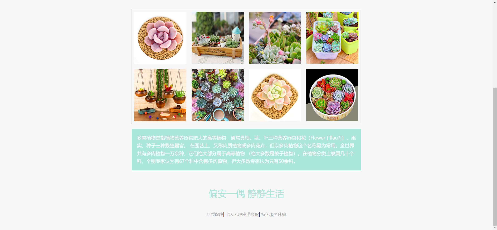

Your job is to design a webpage for a succulent plant store named "多肉商城". The webpage should include a header, a main section displaying the latest products, a section with a description of succulent plants, a footer, and a services section with links. The provided screenshots are rendered under a resolution of 1920x1080.

### Header
- The header should contain an image `images/head.jpg`.

### Main Section
- The main section should have a title "最新肉肉" with a border-radius style.
- Below the title, there should be a grid of product images. Each product should have a hover effect that displays additional information.

### Product Hover Effect
- Each product image should be wrapped in a `div` with the class name `view`.
- On hover, a `div` with the class name `hover` should appear, displaying the product name and description.
- The hover effect should include animations for the appearance of the `hover` div and background elements.

### Product Images and Descriptions
- Use the following images and descriptions for the products:
  - `images/1.jpg`, `images/7.jpg`, `images/3.jpg`, `images/4.jpg`, `images/5.jpg`, `images/6.jpg`, `images/2.jpg`, `images/8.jpg`
  - Product name: "多肉仙人掌"
  - Product description: "多肉植物防辐射 肉肉植物花弈"

### Description Section
- The description section should contain the following text:
  ```
  多肉植物是指植物营养器官肥大的高等植物，通常具根、茎、叶三种营养器官和花（Flower ['flau?]）、果实、种子三种繁殖器官。
  在园艺上，又称肉质植物或多肉花卉，但以多肉植物这个名称最为常用。全世界共有多肉植物一万余种，它们绝大部分属于高等植物
  （绝大多数是被子植物）。在植物分类上隶属几十个科，个别专家认为有67个科中含有多肉植物，但大多数专家认为只有50余科。
  ```

### Footer
- The footer should contain the text "偏安一偶  静静生活".

### Services Section
- The services section should contain three links:
  - "品质保障"
  - "七天无理由退换货"
  - "特色服务体验"


### Screenshots
- Initial webpage: 
- Scrolled webpage: 
- Hover over the first product: 

### CSS Classes and IDs
- Use class name `border-radius` for the title "最新肉肉".
- Use class name `view` for each product container.
- Use class name `hover` for the hover effect container.
- Use class name `services` for the services section.
- Use class name `services a` for the service links.

### Additional Notes
- The webpage should be responsive and maintain the layout and styles as shown in the screenshots.
