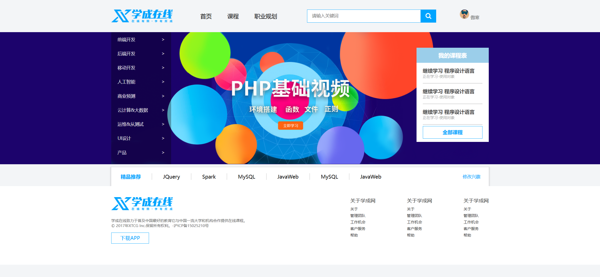

Your job is to design a webpage that replicates the functionality and appearance of the provided webpage. The webpage consists of a header, a banner section, a course section, a goods section, and a footer. Below are the detailed instructions and resources needed to re-implement the webpage.

### Initial Webpage
The initial webpage should look like this:


### Header Section
The header section includes a logo, a navigation bar, a search module, and a user module.

- **Logo**: Use the image `images/logo.png` for the logo.
- **Navigation Bar**: Contains three links: "首页" (Home), "课程" (Courses), and "职业规划" (Career Planning).
  - Use class name `nav` for the navigation bar.
- **Search Module**: Contains an input field and a button.
  - Use class name `search` for the search module.
  - The input field should have a placeholder text "请输入关键词".
  - The button should use the image `images/btn.png` as its background.
- **User Module**: Displays a user icon and the username "傲寒".
  - Use the image `images/user.png` for the user icon.
  - Use class name `user` for the user module.

### Banner Section
The banner section includes a sub-navigation bar and a course module.

- **Sub-navigation Bar**: Contains links to various categories such as "前端开发" (Frontend Development), "后端开发" (Backend Development), etc.
  - Use class name `subnav` for the sub-navigation bar.
- **Course Module**: Displays a list of courses with the title "我的课程表" (My Course Schedule).
  - Use class name `course` for the course module.
  - Each course item should have a title "继续学习 程序设计语言" (Continue Learning Programming Language) and a description "正在学习-使用对象" (Currently Learning - Using Objects).
  - There should be a link "全部课程" (All Courses) at the bottom.
  - Use class name `more` for the "全部课程" link.

### Goods Section
The goods section includes a title "精品推荐" (Recommended), a list of recommended items, and a "修改兴趣" (Modify Interests) link.

- **Title**: Use the text "精品推荐" (Recommended).
- **Recommended Items**: Contains links to various items such as "JQuery", "Spark", "MySQL", etc.
  - Use class name `goods-item` for the list of recommended items.
- **Modify Interests Link**: Use the text "修改兴趣" (Modify Interests).
  - Use class name `mod` for the "修改兴趣" link.

### Footer Section
The footer section includes a logo, a copyright notice, a link to download the app, and additional links.

- **Logo**: Use the image `images/logo.png` for the logo.
- **Copyright Notice**: Use the following text:
  ```
  学成在线致力于普及中国最好的教育它与中国一流大学和机构合作提供在线课程。
  © 2017年XTCG Inc.保留所有权利。-沪ICP备15025210号
  ```
- **Download App Link**: Use the text "下载APP" (Download App).
  
  - Use class name `app` for the download app link.
- **Additional Links**: Contains multiple sections with links such as "关于" (About), "管理团队" (Management Team), etc.

### Resources
- `images/logo.png`: Used for the logo in the header and footer.
- `images/user.png`: Used for the user icon in the header.
- `images/btn.png`: Used for the search button background.
- `images/banner2_20190819_210028.png`: Used as the background image for the banner section.
- Text content for the footer:
  ```
  学成在线致力于普及中国最好的教育它与中国一流大学和机构合作提供在线课程。
  © 2017年XTCG Inc.保留所有权利。-沪ICP备15025210号
  ```

### Notes
- The provided screenshots are rendered under a resolution of 1920x1080.
- Ensure that all interactive elements have the specified IDs or class names for auto-testing.
- Describe any animations if present, but no animations are specified in this task.
