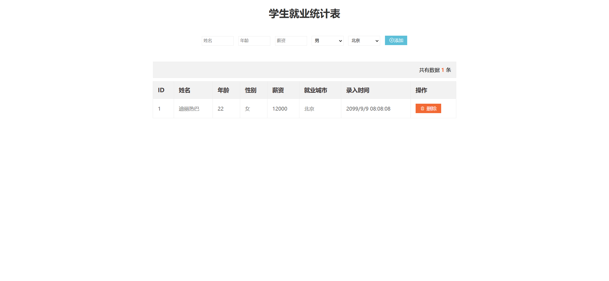
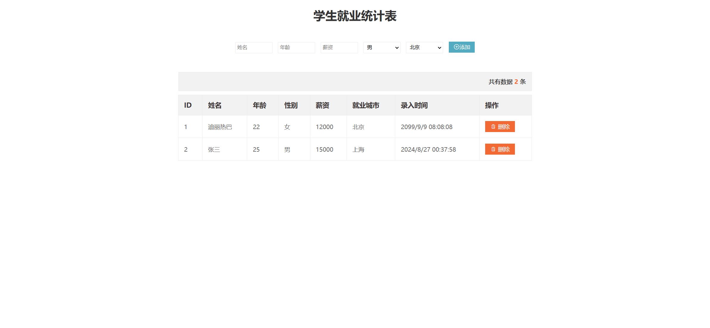
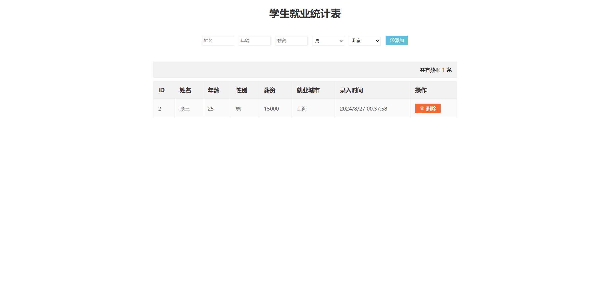

# 学生就业统计表 Webpage Implementation Guide

Your task is to design a webpage that allows users to manage student employment statistics. The webpage should include functionalities to add and delete student records, and it should store data locally using `localStorage`. Below are the detailed instructions and resources needed to re-implement the webpage.

## Initial Webpage

The initial webpage should look like this:



This screenshot was rendered under a resolution of 1920x1080.

## Resources

### External Resources
- **Icon Font**: The webpage uses an icon font for the add and delete buttons. Include the following CSS file in your project:
  ```html
  <link rel="stylesheet" href="./iconfont/iconfont.css">
  ```

### Text Content
- **Page Title**: "学生就业统计表"
- **Form Placeholders**:
  - Name: "姓名"
  - Age: "年龄"
  - Salary: "薪资"
- **Gender Options**:
  - "男"
  - "女"
- **City Options**:
  - "北京"
  - "上海"
  - "广州"
  - "深圳"
  - "曹县"
- **Add Button Text**: "添加"
- **Table Headers**:
  - "ID"
  - "姓名"
  - "年龄"
  - "性别"
  - "薪资"
  - "就业城市"
  - "录入时间"
  - "操作"
- **Delete Button Text**: "删除"
- **Alert Message**: "输入内容不能为空"
- **Confirmation Message**: "您确定要删除这条数据吗？"

## Form Elements

- Use class name `info` for the form element.
- Use element name `uname` for the name input field.
- Use element name `age` for the age input field.
- Use element name `salary` for the salary input field.
- Use element name `gender` for the gender select field.
- Use element name `city` for the city select field.
- Use class name `add` for the add button.

## Table Elements

- Use class name `title` for the div displaying the total number of records.
- Use a `table` element to display the student records.
- Use a `tbody` element within the table to dynamically render student records.

## Interactions

### Adding a Student Record

When a user fills out the form and clicks the add button, a new student record should be added to the table and stored in `localStorage`. The webpage should look like this after adding a record:



### Deleting a Student Record

When a user clicks the delete button next to a student record, a confirmation dialog should appear. If the user confirms, the record should be deleted from the table and `localStorage`. The webpage should look like this after deleting a record:



## CSS Styling

Include the following CSS file in your project:
```html
<link rel="stylesheet" href="style.css">
```

### CSS Rules

- **Title Section**:
  - Use class name `title` for the div displaying the total number of records.
  
- **Table Styles**:
  - Center-align the table.
  

## JavaScript Functionality

- Use `localStorage` to store and retrieve student records.
- Implement form validation to ensure no fields are empty before adding a record.
- Use event delegation to handle delete button clicks within the table.

Follow these instructions to re-implement the webpage. Good luck!
