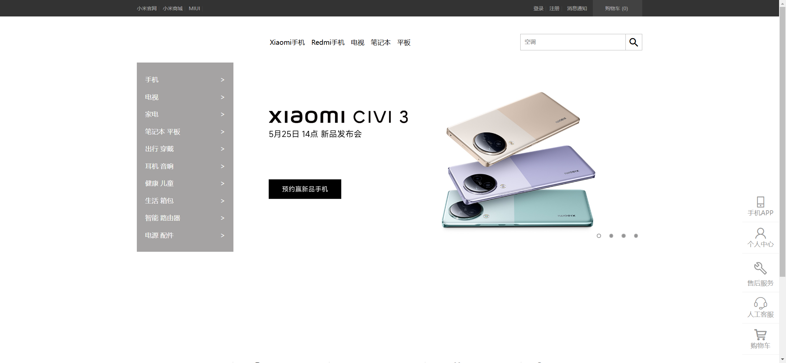
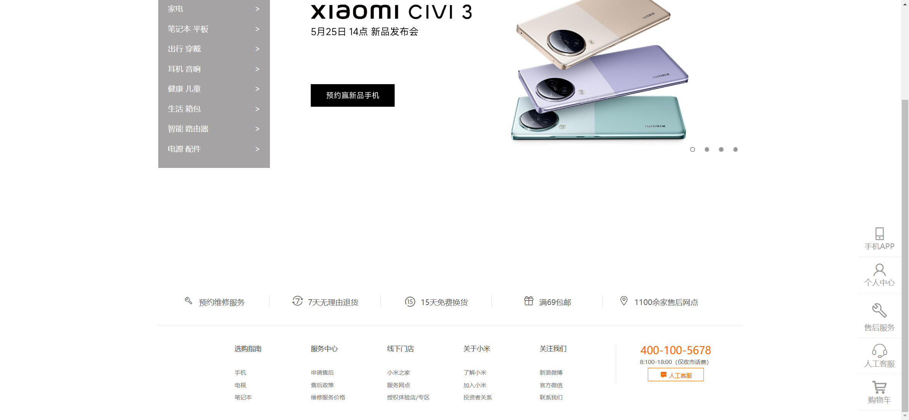

# Task Description for Re-implementing the Xiaomi Mall Webpage

Your job is to design a webpage that replicates the Xiaomi Mall webpage. The webpage should include a header, a side menu, a content section with a banner, and a footer. The provided screenshots are rendered under a resolution of 1920x1080.

## Initial Webpage

The initial webpage should look like this:

## Header

The header consists of two parts: the top bar and the top menu.

### Top Bar

- The top bar contains navigation links and user-related links.
- Use class `topbar` for the top bar container.
- Use class `wrapper` for the inner container.
- Use class `topbar-nav` for the navigation links.
- Use class `user` for the user-related links.
- Use class `shop` for the shopping cart link.

### Top Menu

- The top menu contains the logo, navigation links, and a search bar.
- Use class `top-menu` for the top menu container.
- Use class `logo` for the logo.
- Use class `search` for the search bar.

## Side Menu

The side menu is fixed on the right side of the page and contains several links.

- Use class `side-menu` for the side menu container.
- Use class `side-menu-item` for each menu item.
- Use class `side-menu-active` for the active menu item.

## Content Section

The content section contains a banner with navigation links on the left.

### Banner

- The banner contains an image and navigation buttons.
- Use class `banner` for the banner container.
- Use class `banner-center` for the image container.
- Use class `button-next` for the next button.
- Use class `button-prev` for the previous button.
- Use class `banner-pagination` for the pagination buttons.

## Footer

The footer contains several sections with links and contact information.

- Use class `footer` for the footer container.
- Use class `footer-server` for the service links.
- Use class `footer-links` for the additional links.
- Use class `footer-links-contact` for the contact information.

## Interactions

### Scroll Page

When the page is scrolled, it should look like this:

### Hover Over Side Menu Item

When hovering over a side menu item, it should look like this:

## Resources

- Font icons are used from `./font/iconfont.css`.
- The logo image is `../images/logo-mi2.png`.
- The banner image is `./images/banner1.jpg`.
- The banner navigation buttons use images from `../images/icon-slides.png`.
- The footer slogan image is `https://cdn.cnbj1.fds.api.mi-img.com/staticsfile/global/slogan2020.png`.

## Text Content

### Top Bar Navigation Links

- 小米官网
- 小米商城
- MIUI

### User Links

- 登录
- 注册
- 消息通知

### Shopping Cart

- 购物车 (0)

### Top Menu Navigation Links

- Xiaomi手机
- Redmi手机
- 电视
- 笔记本
- 平板

### Side Menu Links

- 手机APP
- 个人中心
- 售后服务
- 人工客服
- 购物车

### Banner Sidebar Links

- 手机
- 电视
- 家电
- 笔记本 平板
- 出行 穿戴
- 耳机 音响
- 健康 儿童
- 生活 箱包
- 智能 路由器
- 电源 配件

### Footer Service Links

- 预约维修服务
- 7天无理由退货
- 15天免费换货
- 满69包邮
- 1100余家售后网点

### Footer Additional Links

#### 选购指南

- 手机
- 电视
- 笔记本

#### 服务中心

- 申请售后
- 售后政策
- 维修服务价格

#### 线下门店

- 小米之家
- 服务网点
- 授权体验店/专区

#### 关于小米

- 了解小米
- 加入小米
- 投资者关系

#### 关注我们

- 新浪微博
- 官方微信
- 联系我们

### Footer Contact Information

- 400-100-5678
- 8:100-18:00（仅收市话费）
- 人工客服
