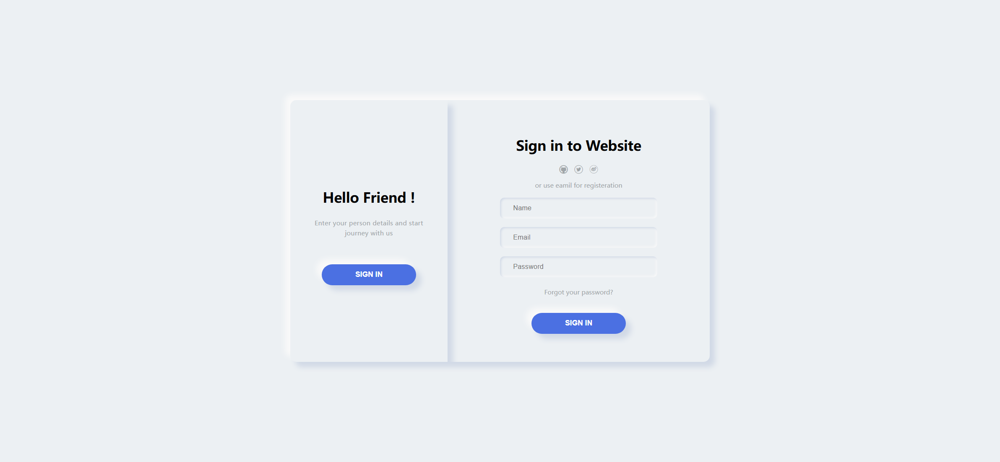
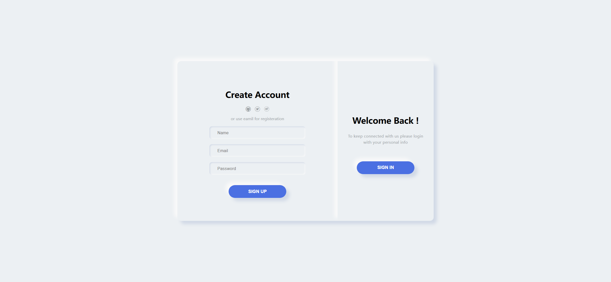

# Task Description: Re-implement a Neumorphism Login and Registration Webpage

Your job is to design a webpage that mimics the provided Neumorphism login and registration interface. The webpage should have a smooth transition between the login and registration forms, and should be visually appealing with neumorphic design elements.

## Initial Webpage

The initial webpage should look like this:

This screenshot is rendered under a resolution of 1920x1080.

## Layout and Design

1. **Container**:
    - Use a `div` with class `container` to wrap the entire content.
    
2. **Switch Panel**:
    - Use a `div` with class `switch-panel` for the panel that contains the switch buttons.
    - Apply the same box-shadow as the container.
    - Position the switch panel absolutely at the top-left corner.
    - Center the content using flexbox.
    - Add a transition effect for smooth sliding: `transition: all .6s ease-in-out`.
    
3. **Switch Box**:
    - Inside the switch panel, create two `div`s with class `switch-box` and IDs `login` and `register`.
    - The `login` switch box should initially have the class `switch-hidden`.
    - Each switch box should contain a title, a paragraph, and a button.
    - The button in the `login` switch box should have ID `switch1`.
    - The button in the `register` switch box should have ID `switch2`.

4. **Register and Login Panels**:
    - Use a `section` with class `register-login-panel` to wrap the register and login forms.
    - Position it absolutely at the top-right corner.
    - Add a transition effect for smooth sliding: `transition: all .6s ease-in-out`.
    
5. **Register and Login Forms**:
    - Inside the register-login panel, create two `section`s with classes `register` and `login`.
    - The `register` section should initially have the class `switch-hidden-2`.
    - Each form should contain a title, social media icons, a span, input fields, and a button.
    - The input fields should have placeholders "Name", "Email", and "Password".
    - The login form should also have a span with the text "Forgot your password?".

## Interactions

1. **Switching Panels**:
    - Clicking the button with ID `switch1` should switch to the login form.
    - Clicking the button with ID `switch2` should switch to the registration form.
    - Use the `switchStyle` function to toggle the classes `switch-panel-slide`, `register-login-panel-slide`, `switch-hidden`, and `switch-hidden-2`.

2. **Filling Forms**:
    - The login form should be filled with:
        - Name: "testuser"
        - Email: "testuser@example.com"
        - Password: "password123"
    - The registration form should be filled with:
        - Name: "newuser"
        - Email: "newuser@example.com"
        - Password: "newpassword123"

## Screenshots of Interactions

1. **After Switching to Login Form**:
    

## Resources

- **Icons**: Use the icon font from `./icon/iconfont.css`.
- **Text Content**:
    - "Welcome Back !"
    - "To keep connected with us please login with your personal info"
    - "SIGN IN"
    - "Hello Friend !"
    - "Enter your person details and start journey with us"
    - "Create Account"
    - "or use email for registration"
    - "Sign in to Website"
    - "Forgot your password?"

## Styling

- **Neumorphism Effect**: Apply box-shadow for the neumorphic effect.
- **Transitions**: Use smooth transitions for sliding panels and button clicks.
- **Flexbox**: Use flexbox for centering content.

## IDs and Classes

- Use ID `switch1` for the button that switches to the login form.
- Use ID `switch2` for the button that switches to the registration form.
- Use class `container` for the main container.
- Use class `switch-panel` for the panel containing switch buttons.
- Use class `switch-box` for the individual switch boxes.
- Use class `register-login-panel` for the panel containing the forms.
- Use class `register` for the registration form.
- Use class `login` for the login form.
- Use class `switch-hidden` and `switch-hidden-2` for hiding elements.
- Use class `switch-panel-slide` and `register-login-panel-slide` for sliding panels.

Re-implement the webpage according to the above description.
