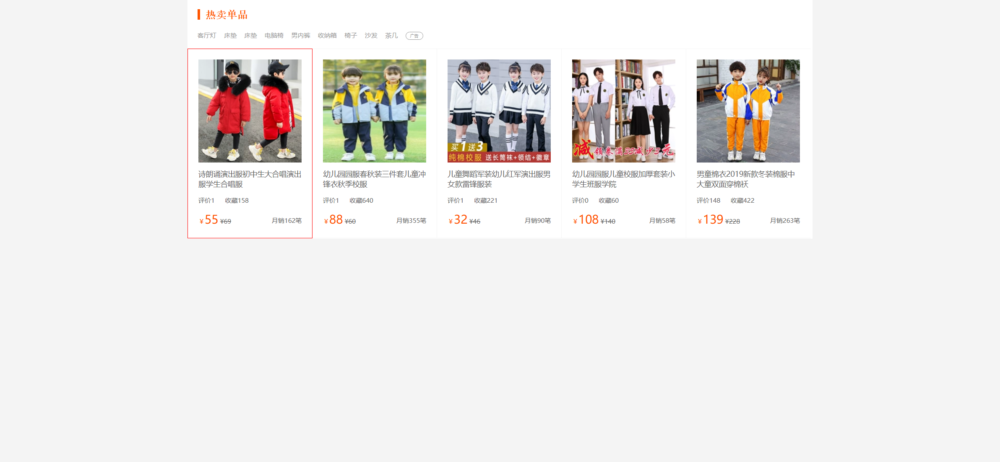

Your job is to design a webpage that mimics the provided 淘宝案例 (Taobao Case) webpage. The webpage should display a list of hot-selling products with various interactive elements. The provided screenshots are rendered under a resolution of 1920x1080.

### Initial Webpage
The initial webpage should look like this:

### Layout and Structure
1. **Main Container**:
   - Use a `div` with class `list` to contain the entire product list section.
   
2. **Header**:
   - Inside the `list` div, add an `h1` element with the text "热卖单品".
   
3. **Advertisement Menu**:
   - Below the header, add a `div` with class `ad`.
   - Inside the `ad` div, add multiple `a` elements with the following text: "客厅灯", "床垫", "床垫", "电脑椅", "男内裤", "收纳箱", "椅子", "沙发", "茶几".
   - Add a `span` with class `tip` and text "广告".
   
4. **Product List**:
   - Below the `ad` div, add a `ul` element.
   - Inside the `ul`, add multiple `li` elements for each product.
   - Each `li` should contain:
     - An `a` element wrapping an `img` element for the product image.
     - An `a` element with class `pname` for the product name.
     - A `div` with class `love` containing:
       - An `a` element with class `comment` and text "评价" followed by an `em` element with the number of comments.
       - An `a` element with class `collect` and text "收藏" followed by an `em` element with the number of collections.
     - A `div` with class `sale` containing:
       - An `a` element with class `price` containing:
         - An `ins` element with a `span` element for the currency symbol and an `em` element for the price.
         - A `del` element for the original price.
       - An `a` element with class `sell` and text "月销" followed by an `em` element with the number of sales.

### Interactions
2. **Hover over First Product**:
   - Hovering over the first product should change its border color to red.
   - Screenshot after hovering over the first product:
     

### Resources
- **Images**:
  - `imgs/1.webp` for the first product image.
  - `imgs/2.webp` for the second product image.
  - `imgs/3.webp` for the third product image.
  - `imgs/4.webp` for the fourth product image.
  - `imgs/5.webp` for the fifth product image.

### IDs and Classes
- Use class `list` for the main container.
- Use class `ad` for the advertisement menu.
- Use class `tip` for the advertisement tip.
- Use class `pname` for product names.
- Use class `love` for the love section.
- Use class `comment` for the comment link.
- Use class `collect` for the collect link.
- Use class `sale` for the sale section.
- Use class `price` for the price link.
- Use class `sell` for the sell link.
