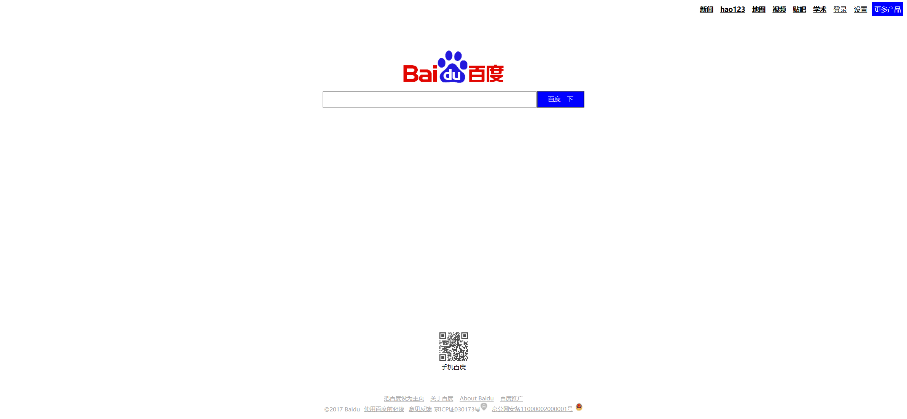

Your job is to design a webpage that mimics the provided layout and functionality. The webpage should include a header with navigation links, a logo, a search bar, a QR code section, and a footer with additional links and information. The provided screenshots are rendered under a resolution of 1920x1080.

### Initial Webpage
The initial webpage should look like this:

### Header
- Inside the header, there should be a `div` element containing the following links: "新闻", "hao123", "地图", "视频", "贴吧", "学术", "登录", "设置", "更多产品".
- The "登录" and "设置" links should have normal font weight.
- The "更多产品" link should have a blue background color, white text color, no text decoration, and normal font weight.

### Logo
- The logo should be centered on the page.
- Use the image `images/bd_logo1.png` for the logo.

### Search Bar
- The search bar should be centered on the page
- The search button should have the text "百度一下".

### QR Code Section
- The QR code section should be centered on the page.
- Use the image `images/m1.png` for the QR code.
- Below the QR code, there should be a text "手机百度" .

### Footer
- The footer should contain two sections: `ft` and `z`.
- The `ft` section should contain the following links: "把百度设为主页", "关于百度", "About Baidu", "百度推广".
- The `z` section should have dark gray text color, a font size of 12px, and centered alignment. It should contain the text: `&copy;2017 Baidu` followed by the links "使用百度前必读" and "意见反馈", and the text "京ICP证030173号". Use the image `images/jh1.png` and `images/jh2.png` for the icons in this section. The link "京公网安备11000002000001号" should have an ID of `2`.

### Resources
- `images/bd_logo1.png` is used for the logo.
- `images/m1.png` is used for the QR code.
- `images/jh1.png` and `images/jh2.png` are used for the icons in the footer section.

Ensure that all elements and interactions are implemented as described. Use the provided screenshots to verify the layout and functionality.
