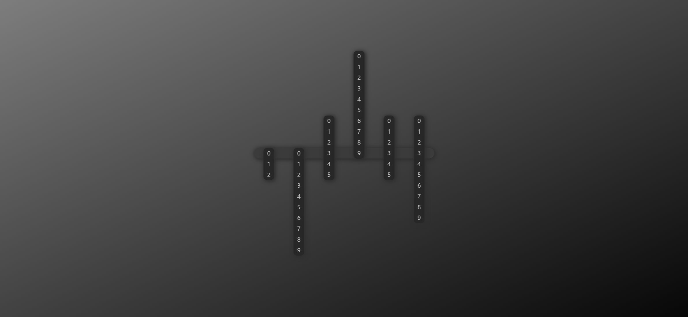

# Task Description: Digital Clock Webpage

Your job is to design a webpage that displays a digital clock with a unique visual style. The clock should show the current time in hours, minutes, and seconds, and update every second. The provided screenshots are rendered under a resolution of 1920x1080.

## Initial Webpage

The initial webpage should look like this:

## Layout and Styling

1. **Background**:
   - The background should be a linear gradient.

2. **Container**:
   - Use a `div` with class `container` to center the clock on the page.
   - The container should be positioned fixed, centered both horizontally and vertically.

3. **Clock**:
   - Use a `div` with class `clock` to hold the time boxes.
   
4. **Time Boxes**:
   - Each time box should be a `div` with class `time-box`.
   
5. **Numbers**:
   - Each number should be inside a `div` with class `numbers`.
   - The transition for the numbers should be `all 0.5s`.

## Time Display

1. **Hours**:
   - The first digit of the hour should be in a `div` with ID `hours-first`.
   - The second digit of the hour should be in a `div` with ID `hours-second`.

2. **Minutes**:
   - The first digit of the minutes should be in a `div` with ID `minutes-first`.
   - The second digit of the minutes should be in a `div` with ID `minutes-second`.

3. **Seconds**:
   - The first digit of the seconds should be in a `div` with ID `seconds-first`.
   - The second digit of the seconds should be in a `div` with ID `seconds-second`.

## JavaScript Functionality

1. **Time Update**:
   - Use JavaScript to update the time every second.
   - The time should be displayed using a sliding animation where the numbers slide up and down.

2. **Number Handling**:
   - Use a function to handle the conversion of numbers to their respective digits.

3. **Animation**:
   - The numbers should slide up and down to show the current time.
   - Use the `transform` property to achieve the sliding effect.

## Example of Time Display

- For the time `12:34:56`, the digits should be displayed as follows:
  - `1` in `hours-first`
  - `2` in `hours-second`
  - `3` in `minutes-first`
  - `4` in `minutes-second`
  - `5` in `seconds-first`
  - `6` in `seconds-second`
