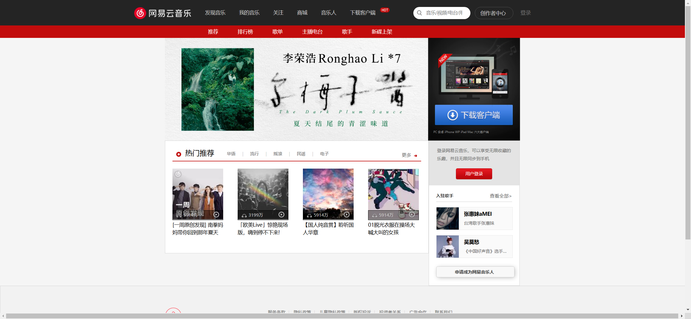
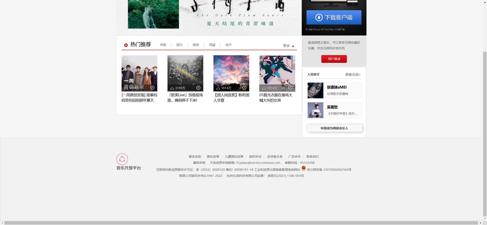

Your job is to design a webpage that replicates the provided structure and functionality. The webpage should be rendered under a resolution of 1920x1080. Below are the detailed instructions and resources needed to re-implement the webpage.

### Initial Webpage
The initial webpage should look like this:


### Header Section
1. **Logo**: 
   - Use a `div` with class `logo` and `Float`.
   - The logo image is located at `images/topbar.png` with specific background positioning.
   
2. **Navigation Bar**:
   - Use an unordered list (`ul`) with class `nav Float no14`.
   - Each list item (`li`) should contain an anchor (`a`) tag with the following text: "发现音乐", "我的音乐", "关注", "商城", "音乐人", "下载客户端".
   - The "下载客户端" item should have a `div` with class `hot` for the hot icon.

3. **Search Bar**:
   - Use a `div` with class `Search Float`.
   - Inside it, include a `div` with class `Search-logo Float` and an `input` element with placeholder "音乐/视频/电台/用户".

4. **Creator Center**:
   - Use a `div` with class `Creator-center Float no14`.
   - Inside it, include an anchor (`a`) tag with text "创作者中心".

5. **Login**:
   - Use a `div` with class `login no14`.
   - Inside it, include an anchor (`a`) tag with text "登录".

### Sub-navigation Section
- Use a `div` with class `subnav`.
- Inside it, use an unordered list (`ul`) with class `nav no14 Float`.
- Each list item (`li`) should contain an anchor (`a`) tag with an `em` element inside it. The `em` elements should have the following text: "推荐", "排行榜", "歌单", "主播电台", "歌手", "新碟上架".

### Banner Section
- Use a `div` with class `banner center Rel`.
- Inside it, include an anchor (`a`) tag with an `img` element. The image source is `images/banner-1.jpg`.
- Include a `div` with class `download Float Rel` containing another anchor (`a`) tag and an `h6` element with text "PC 安卓 iPhone WP iPad Mac 六大客户端".

### Main Content Section
- Use a `div` with class `box center clearfix`.
- Inside it, create a `div` with class `main main-w Float Border`.
  - **Main Navigation**:
    - Use a `div` with class `main-nav Rel`.
    - Include a `div` with class `pic-left`.
    - Include an `h1` element with text "热门推荐".
    - Include a `div` with class `tab Float` containing multiple anchor (`a`) tags with text "华语", "流行", "摇滚", "民谣", "电子".
    - Include a `div` with class `pic-right` containing an anchor (`a`) tag with text "更多".
  - **List Items**:
    - Use an unordered list (`ul`).
    - Each list item (`li`) should contain:
      - A `div` with class `info Rel` containing an anchor (`a`) tag with class `menu-1`, `menu-2`, etc., and a `div` with class `bottom` containing:
        - A `span` with class `icon-headset Float`.
        - A `span` with class `nb` containing numbers like "5914万".
        - An anchor (`a`) tag with class `icon-play`.
      - An anchor (`a`) tag with text like "[一周原创发现] 南拳妈妈带你回到那年夏天".

### Sidebar Section
- Use a `div` with class `sidebar sidebar-w Float Border`.
  - **Login Module**:
    - Use a `div` with class `login`.
    - Include a `p` element with text "登录网易云音乐，可以享受无限收藏的乐趣，并且无限同步到手机".
    - Include an anchor (`a`) tag with text "用户登录".
  - **Singer Section**:
    - Use a `div` with class `s-Singer`.
    - Include a `h3` element with class `s-nav` containing a `span` with text "入驻歌手" and an anchor (`a`) tag with text "查看全部>".
    - Use an unordered list (`ul`) with class `s-enert`.
    - Each list item (`li`) should contain an anchor (`a`) tag with a `div` with class `head Float` containing an `img` element, and a `div` with class `flo Float` containing:
      - An `h4` element with text like "张惠妹aMEI".
      - A `p` element with text like "台湾歌手张惠妹".
    - Include a `div` containing an anchor (`a`) tag with text "申请成为网易音乐人".

### Footer Section
- Use a `div` with class `footer Border`.
- Inside it, use a `div` with class `links center`.
  - Use an unordered list (`ul`) containing list items (`li`) with anchor (`a`) tags and `span` elements with text like "音乐开放平台".
  - Include a `div` with class `copy center` containing multiple `p` elements with anchor (`a`) tags and text like:
    ```
    <a href="https://st.music.163.com/official-terms/service" target="_blank">服务条款</a><span class="line">|</span>
    <a href="https://st.music.163.com/official-terms/privacy" target="_blank">隐私政策</a><span class="line">|</span>
    <a href="https://st.music.163.com/official-terms/privacy" target="_blank">儿童隐私政策</a><span class="line">|</span>
    <a href="https://music.163.com/st/staticdeal/complaints.html" target="_blank">版权投诉</a><span class="line">|</span>
    <a href="http://ir.music.163.com/en/index.php" target="_blank">投资者关系</a><span class="line">|</span>
    <a href="https://music.163.com/ui/resource" target="_blank">广告合作</a><span class="line">|</span>
    <a href="https://mp.music.163.com/600948c936c13f4d09752e73/contact-us-web/index.html?source=Music-Main-Station" target="_blank">联系我们</a>
    ```

### Interactions
1. **Scroll Page**:
   - The page should scroll to the bottom.
   - Screenshot after scrolling: 

   
   

### Resources
- Images:
  - `images/topbar.png` for the header logo and search icon.
  - `images/banner-1.jpg` for the banner image.
  - `images/download.jpg` for the download section in the banner.
  - `images/menu-1.jpg`, `images/menu-2.jpg`, etc., for the list item images.
  - `images/Singer-1.jpg`, `images/Singer-2.jpg` for the singer images.
  - `images/iconall.png` for the icons in the list items.
  - `images/index.png` for various icons in the main content and sidebar.
  - `images/foot_enter_new2.png` for the footer icons.
  - `images/police.png` for the footer police icon.
