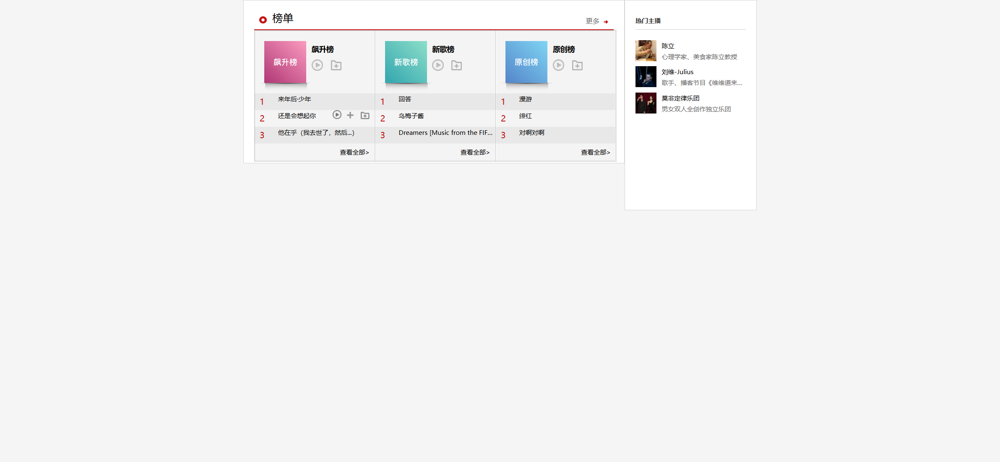

Your job is to design a webpage that displays a music ranking list with various categories and a sidebar featuring popular anchors. The webpage should be styled according to the provided CSS file and should include hover interactions as described. The initial webpage should be rendered under a (1920, 1080) resolution.

The initial webpage should look like this:

### Layout and Structure

1. **Main Container**
   - Use a `div` with class `app` to wrap the entire content.
   - Inside the `app` div, create another `div` with class `box center clearfix`.

2. **Main Content**
   - Create a `div` with class `main main-w Float Border` for the main content area.
   - Inside this `div`, create a `div` with class `c-top main-w`.

3. **Navigation Bar**
   - Create a `div` with class `main-nav Rel`.
   - Inside this `div`, add a `div` with class `pic-left`.
   - Add an `h1` with class `Float` and text content "榜单".
   - Add a `div` with class `pic-right` containing an anchor tag with class `Float` and text content "更多".

4. **Ranking Lists**
   - Create a `div` with class `box Border Rel`.
   - Inside this `div`, create multiple `dl` elements for each ranking list (飙升榜, 新歌榜, 原创榜).
   - Each `dl` should contain a `dt` with class `top` and a `dd` containing an `ol` with `li` elements for each song.

5. **Sidebar**
   - Create a `div` with class `sidebar sidebar-w Float Border`.
   - Inside this `div`, create a `div` with class `anchor`.
   - Add an `h3` with class `s-nav` containing a `span` with class `title` and text content "热门主播".
   - Create a `ul` with class `hotdj` containing `li` elements for each anchor.

### Resources

- **Images**
  - `images/Soar.jpg` for the 飙升榜 image.
  - `images/New song.jpg` for the 新歌榜 image.
  - `images/Original.jpg` for the 原创榜 image.
  - `images/hotdj-1.jpg`, `images/hotdj-2.jpg`, `images/hotdj-3.jpg` for the anchor images.

- **Text Content**
  - The text content for the songs and anchors should be as follows:
    - 飙升榜:
      - 来年后·少年
      - 还是会想起你
      - 他在乎（我去世了，然后...）
    - 新歌榜:
      - 回答
      - 乌梅子酱
      - Dreamers [Music from the FIFA World Cup Qatar 2022 Official Soundtrack]
    - 原创榜:
      - 漫游
      - 绯红
      - 对啊对啊
    - 热门主播:
      - 陈立: 心理学家、美食家陈立教授
      - 刘维-Julius: 歌手、播客节目《维维道来》主理人
      - 莫非定律乐团: 男女双人全创作独立乐团

### Hover Interactions

4. **Hover on First Song in Soaring List**
   - Hover on the first song in the 飙升榜 list.
   - The webpage should look like this:
     

### Element Identifiers

- Use class `app` for the main container.
- Use class `box center clearfix` for the main content wrapper.
- Use class `main main-w Float Border` for the main content area.
- Use class `c-top main-w` for the top section of the main content.
- Use class `main-nav Rel` for the navigation bar.
- Use class `pic-left` for the left picture in the navigation bar.
- Use class `Float` for floating elements.
- Use class `pic-right` for the right picture in the navigation bar.
- Use class `box Border Rel` for the ranking lists container.
- Use class `top` for the top section of each ranking list.
- Use class `sidebar sidebar-w Float Border` for the sidebar.
- Use class `anchor` for the anchor section in the sidebar.
- Use class `s-nav` for the sidebar navigation.
- Use class `hotdj` for the list of hot DJs.
