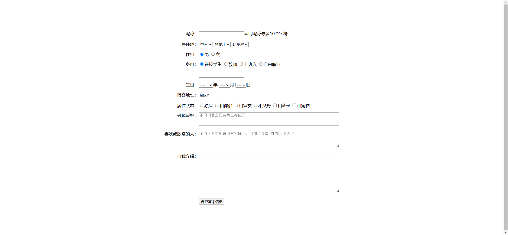

Your job is to design a webpage that consists of a form with various input fields. The form should be centered on the page and styled according to the provided specifications. The initial webpage should be .

### Requirements:

1. **HTML Structure**:
    - Create a table with the class `main` to hold the form elements.
    - Each row (`<tr>`) of the table should contain two cells (`<td>`):
        - The first cell should have the class `title` and contain the label for the input field.
        - The second cell should contain the input field itself.

2. **CSS Styling**:

    - Align the text in the cells with the class `title` to the end and vertically align them to the top.

3. **Form Fields**:
    - **Nickname**:
        - Label: "昵称："
        - Input: Text input field with a placeholder text "您的昵称最多10个字符".
    - **Residence**:
        - Label: "居住地："
        - Input: Three dropdowns for country, state, and city.
            - Country options: 中国, 美国, 日本
            - State options: 黑龙江, 江苏, 内蒙古
            - City options: 哈尔滨, 绥化, 日本
    - **Gender**:
        - Label: "性别："
        - Input: Two radio buttons for male and female.
            - Use `name="sex"` for the radio buttons.
            - Default selection: Male
    - **Identity**:
        - Label: "身份："
        - Input: Four radio buttons for different identities.
            - Use `name="identity"` for the radio buttons.
            - Default selection: 在校学生
    - **Birthday**:
        - Label: "生日："
        - Input: Three dropdowns for year, month, and day.
            - Year options: ----, 2024, 2023
            - Month options: ----, 1, 2
            - Day options: ----, 3, 4
    - **Blog URL**:
        - Label: "博客地址："
        - Input: Text input field with a default value "http://".
    - **Living Status**:
        - Label: "居住状态："
        - Input: Six checkboxes for different living statuses.
    - **Hobbies**:
        - Label: "兴趣爱好："
        - Input: Textarea with a placeholder "不同项目之间请用空格隔开".
    - **Favorite People**:
        - Label: "喜欢或欣赏的人："
        - Input: Textarea with a placeholder "不同人名之间请用空格隔开，例如“金庸 周杰伦 姚明”".
    - **Self Introduction**:
        - Label: "自我介绍："
        - Input: Textarea with no placeholder.
    - **Submit Button**:
        - Input: Button with the text "保存基本信息".

    
    

### Notes:
- The provided screenshots are rendered under a resolution of 1920x1080.
- Ensure that the IDs, names, and class names are used as specified for the elements to facilitate interaction and testing.
