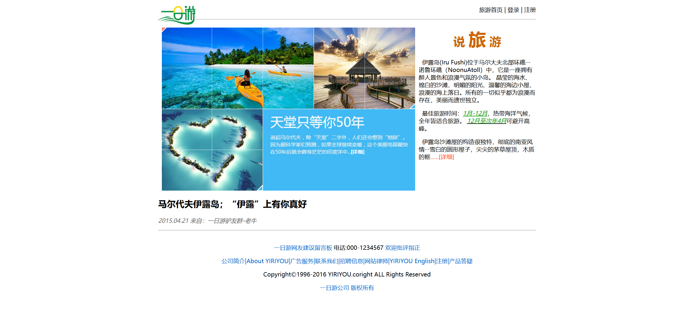

Your job is to design a webpage that replicates the given layout and content. The initial webpage should be .

### General Layout
- The webpage consists of several sections: a header, a main content area, a sub-section, and a footer.

### Header
- The header contains a logo image (`images/logo.png`) aligned to the left.
- To the right of the logo, there is a navigation text: "旅游首页 | 登录 | 注册".
- Below the header, there is a horizontal line.

### Main Content Area
- The main content area is divided into two parts:
  1. **Banner and Title Section**:
     - An image (`images/banner1.jpg`) is aligned to the left
     - The title "说旅游" is displayed using a combination of different font sizes:
       - "说" and "游" use font size 6.
       - "旅" uses font size +6.
     - The title text is bold and centered.
  2. **Description Section**:
     - The description text is as follows:
       ```
       伊露岛(Iru Fushi)位于马尔大夫北部环礁--诺鲁环礁（NoonuAtoll）中，它是一座拥有醉人景色和浪漫气氛的小岛。
       晶莹的海水、棉白的沙滩、明媚的阳光、温馨的海边小屋、浪漫的海上落日。所有的一切似乎都为浪漫而存在，美丽而遗世独立。
       ```
     - The best travel time text is:
       ```
       最佳旅游时间：1月-12月，热带海洋气候，全年皆适合旅游。12月至次年4月可避开高峰。
       ```
     - The additional description text is:
       ```
       伊露岛沙滩屋的构造很独特，彻底的南亚风情--雪白的圆形屋子，尖尖的茅草屋顶，木质的框......[详细]
       ```

### Sub-Section
- The sub-section contains a title and a date:
  - Title: "马尔代夫伊露岛；“伊露”上有你真好"
  - Date: "2015.04.21 来自：一日游驴友群-老牛"
- Below the sub-section, there is a horizontal line.

### Footer
- The footer contains several lines of text:
  1. "一日游网友建议留言板 电话:000-1234567 欢迎批评指正"
  2. "公司简介|About YIRIYOU|广告服务|联系我们|招聘信息|网站律师|YIRIYOU English|注册|产品答疑"
  3. "Copyright©1996-2016 YIRIYOU.coright ALL Rights Reserved"
  4. "一日游公司 版权所有"
     - Use blue color (`#06C`) for the last line.

### CSS Styling
- Specific IDs and class names to use:
  - Use ID `h1` for the title "说旅游".
  - Use ID `second` for the main content area.
  - Use ID `maerdaifu` for the sub-section.
  - Use ID `xt` for the date in the sub-section.
  - Use ID `five` for the footer.
  - Use ID `foot` for the first and third lines in the footer.
  - Use ID `footcolor` for the second and fourth lines in the footer.

### Resources
- Images:
  - `images/logo.png` for the logo in the header.
  - `images/banner1.jpg` for the banner in the main content area.
- Text content:
  - Description text in the main content area.
  - Best travel time text in the main content area.
  - Additional description text in the main content area.
  - Title and date in the sub-section.
  - Footer text.

The provided screenshots are rendered under a resolution of 1920x1080.
