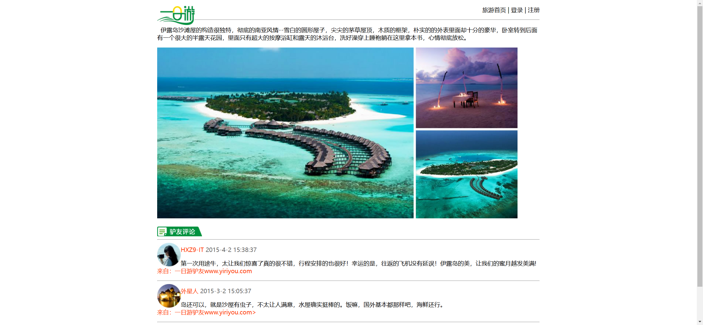

Your job is to design a webpage that replicates the given layout and functionality. The webpage is a travel-themed site with various sections and interactive elements. The provided screenshots are rendered under a resolution of 1920x1080.

### Initial Webpage
The initial webpage should look like this:


### Layout and Elements

1. **Header Section**
    - Use an image `images/logo.png` aligned to the left.
    - A paragraph aligned to the right with the text: "旅游首页 | 登录 | 注册".
    - Use a horizontal line (`<hr>`) to separate the header from the rest of the content.

2. **Main Content Section**
    - **Section 1 (ID: `three`)**
        - A paragraph with the following text:
          ```
          伊露岛沙滩屋的构造很独特，彻底的南亚风情--雪白的圆形屋子，尖尖的茅草屋顶，木质的框架，朴实的的外表里面却十分的豪华，卧室转到后面有一个很大的半露天花园，里面只有超大的按摩浴缸和露天的沐浴台，洗好澡穿上睡袍躺在这里拿本书，心情彻底放松。
          ```
        - An image `images/banner2.jpg` aligned to the left.

    - **Section 2 (ID: `four`)**
        - An image `images/icon.gif`.
        - A horizontal line (`<hr>`).
        - Three reviews, each containing:
            - An image (`images/person1.jpg`, `images/person2.jpg`, `images/person3.jpg`) aligned to the left.
            - A paragraph with the reviewer's name in red and the date in grey.
            - A paragraph with the review text and a source link in red.
            - Use a horizontal line (`<hr>`) to separate each review.

### CSS Styling
- Ensure the following IDs are used for the respective elements:
    - `three` for the first content section.
    - `four` for the second content section.

### Resources
- `images/logo.png` for the logo in the header.
- `images/banner2.jpg` for the banner in the first content section.
- `images/icon.gif` for the icon in the second content section.
- `images/person1.jpg`, `images/person2.jpg`, `images/person3.jpg` for the reviewer images in the second content section.

### Text Content
- Header right-aligned text: "旅游首页 | 登录 | 注册".
- Section 1 paragraph text:
  ```
  伊露岛沙滩屋的构造很独特，彻底的南亚风情--雪白的圆形屋子，尖尖的茅草屋顶，木质的框架，朴实的的外表里面却十分的豪华，卧室转到后面有一个很大的半露天花园，里面只有超大的按摩浴缸和露天的沐浴台，洗好澡穿上睡袍躺在这里拿本书，心情彻底放松。
  ```
- Section 2 review texts:
  - Review 1:
    ```
    HXZ9-IT 2015-4-2 15:38:37
    第一次用途牛，太让我们惊喜了真的很不错，行程安排的也很好！幸运的是，往返的飞机没有延误！伊露岛的美，让我们的蜜月越发美满!
    来自：一日游驴友www.yiriyou.com
    ```
  - Review 2:
    ```
    外星人 2015-3-2 15:05:37
    岛还可以，就是沙屋有虫子，不太让人满意，水屋确实挺棒的。饭嘛，国外基本都那样吧，海鲜还行。
    来自：一日游驴友www.yiriyou.com
    ```
  - Review 3:
    ```
    so-cool 2015-2-14 10:38:36
    行程安排挺好的，挺喜欢伊露岛，岛上的人很热情，手机丢了小黑给找回来了，都很热情，会主动跟你打招呼！
    来自：一日游驴友www.yiriyou.com
    ```
