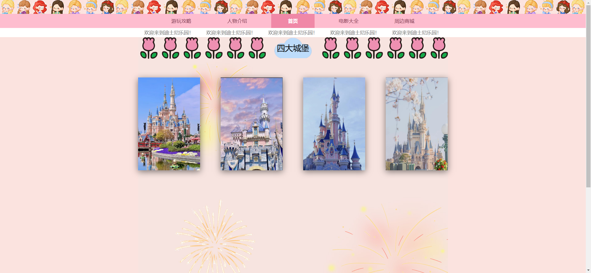
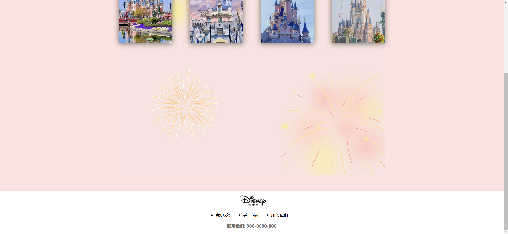
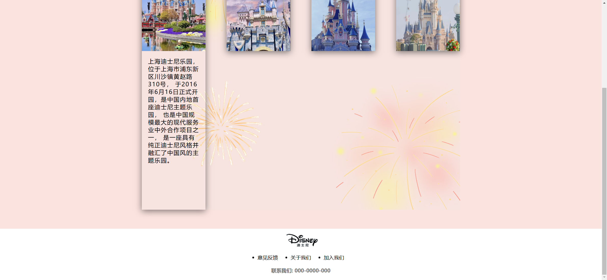
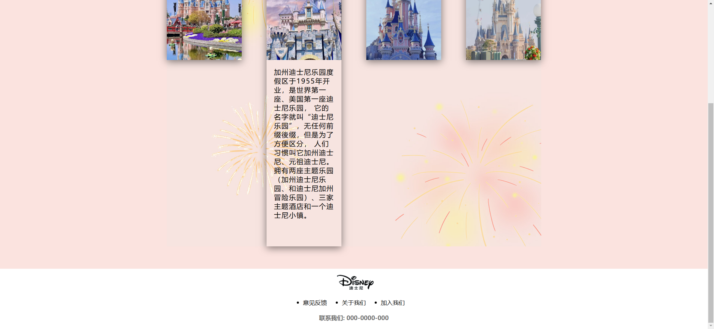
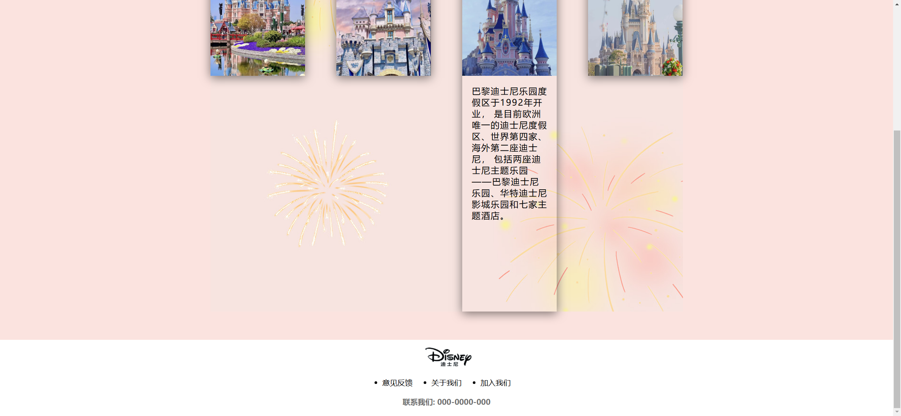
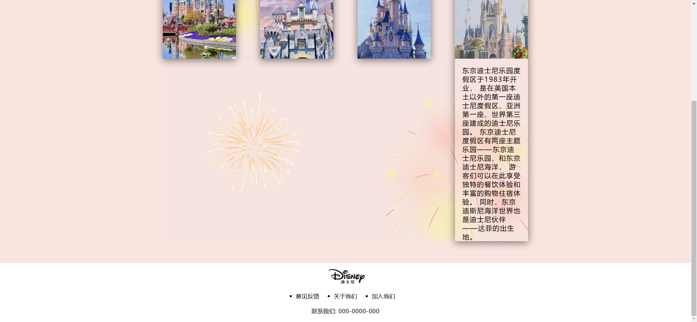

Your job is to design a webpage that replicates the provided Disney-themed webpage. The webpage consists of a header, a content section showcasing four Disney castles, and a footer. The initial webpage should be .

### General Layout
- The webpage should have a header, a content section, and a footer.
- The content section should be wrapped in a container with a class name `wrapper`.

### Header
- The header should have a class name `header`.
- The header contains three main parts:
  1. An image section with a class name `header-img` that uses `./images/header.png` as the background image.
  2. A navigation bar with a class name `header-nav` containing five list items:
     - 游玩攻略
     - 人物介绍
     - 首页 (this should have an additional class `nav-active`)
     - 电影大全
     - 周边商城
  3. A welcome message section with a class name `header-welcome` containing five paragraphs, each with the text "欢迎来到迪士尼乐园！".

### Content Section
- The content section should have a class name `content` and a background image `./images/bgc.jpg`.
- The top title should have a class name `top-title` and contain three parts:
  - A left section with a class name `left` using `./images/index/Decorate/flower.png` as the background image.
  - A center section with a class name `center` containing the text "四大城堡" and using `./images/index/Decorate/cloud.png` as the background image.
  - A right section with a class name `right` using `./images/index/Decorate/flower.png` as the background image.
- The content should display four rows, each representing a Disney castle. Each row should have a class name `content-row` and contain:
  - An image section with a class name `row-img`.
  - A title section with a class name `row-title`.

### Castle Descriptions
1. **Shanghai Disney Resort**
   - Image: `./images/index/castle/shanghai.jpg`
   - Description: 
     ```
     上海迪士尼乐园，位于上海市浦东新区川沙镇黄赵路310号，
     于2016年6月16日正式开园，是中国内地首座迪士尼主题乐园，
     也是中国规模最大的现代服务业中外合作项目之一，
     是一座具有纯正迪士尼风格并融汇了中国风的主题乐园。
     ```

2. **California Disney Resort**
   - Image: `./images/index/castle/usa.jpg`
   - Description:
     ```
     加州迪士尼乐园度假区于1955年开业，是世界第一座、美国第一座迪士尼乐园，
     它的名字就叫“迪士尼乐园”，无任何前缀後缀，但是为了方便区分，
     人们习惯叫它加州迪士尼、元祖迪士尼。
     拥有两座主题乐园（加州迪士尼乐园、和迪士尼加州冒险乐园）、三家主题酒店和一个迪士尼小镇。
     ```

3. **Paris Disney Resort**
   - Image: `./images/index/castle/Paris.jpg`
   - Description:
     ```
     巴黎迪士尼乐园度假区于1992年开业，
     是目前欧洲唯一的迪士尼度假区、世界第四家、海外第二座迪士尼，
     包括两座迪士尼主题乐园——巴黎迪士尼乐园、华特迪士尼影城乐园和七家主题酒店。
     ```

4. **Tokyo Disney Resort**
   - Image: `./images/index/castle/Tokyo.jpg`
   - Description:
     ```
     东京迪士尼乐园度假区于1983年开业，
     是在美国本土以外的第一座迪士尼度假区、亚洲第一座、世界第三座建成的迪士尼乐园。
     东京迪士尼度假区有两座主题乐园——东京迪士尼乐园、和东京迪士尼海洋，
     游客们可以在此享受独特的餐饮体验和丰富的购物住宿体验。
     同时，东京迪斯尼海洋世界也是迪士尼伙伴——达菲的出生地。
     ```

### Footer
- The footer should have a class name `footer`.
- The footer contains:
  - A logo section with a class name `footer-logo` using `./images/logo.png` as the image source.
  - A list of links with a class name `footer-list` containing:
    - 意见反馈
    - 关于我们
    - 加入我们
  - A contact section with a class name `footer-phone` containing the text "联系我们: 000-0000-000".

### Interactions
- When the page is scrolled, it should look like .
- When hovering over each castle, the height of the `content-row` should expand to 800px. The hover states should look like:
  - 
  - 
  - 
  - 

### Additional Notes
- The provided screenshots are rendered under a resolution of 1920x1080.
- Use the following class names and IDs for elements:
  - Use class name `header` for the header section.
  - Use class name `header-img` for the header image section.
  - Use class name `header-nav` for the navigation bar.
  - Use class name `nav-active` for the active navigation item.
  - Use class name `header-welcome` for the welcome message section.
  - Use class name `content` for the content section.
  - Use class name `wrapper` for the content wrapper.
  - Use class name `top-title` for the top title section.
  - Use class name `left` for the left part of the top title.
  - Use class name `center` for the center part of the top title.
  - Use class name `right` for the right part of the top title.
  - Use class name `content-row` for each castle row.
  - Use class name `row-img` for the image section of each castle row.
  - Use class name `row-title` for the title section of each castle row.
  - Use class name `footer` for the footer section.
  - Use class name `footer-logo` for the footer logo section.
  - Use class name `footer-list` for the footer list of links.
  - Use class name `footer-phone` for the footer contact section.
