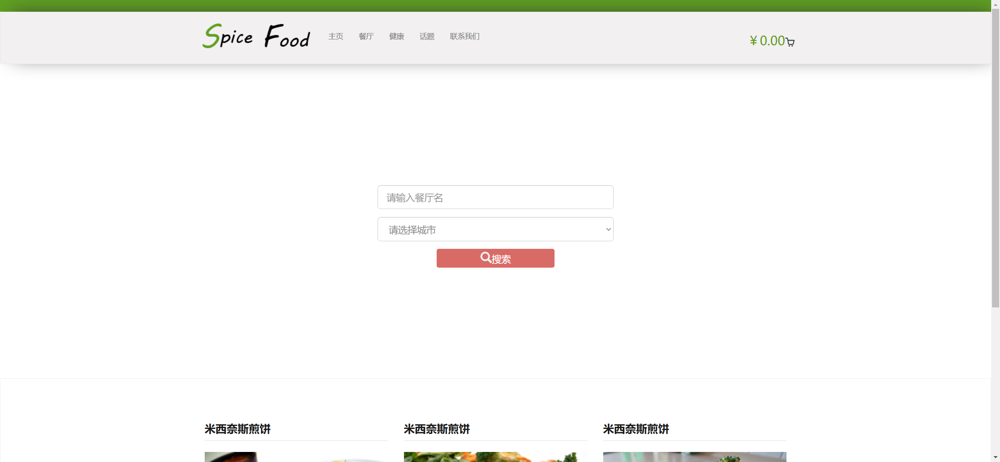
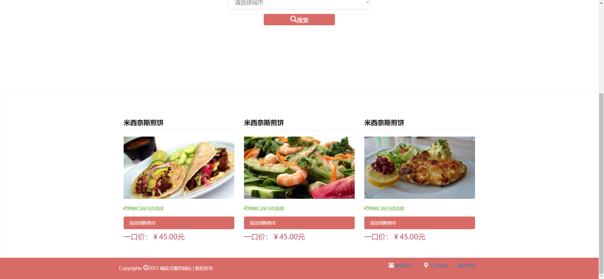

Your job is to design a webpage for a restaurant-themed site called "Spice Food". The webpage should include a header with a navigation bar, a search section, a hot items section, and a footer. Below are the detailed instructions and resources needed to re-implement the webpage.

### Initial Webpage
The initial webpage should look like this:

### Header
1. **Top Bar**: 
   - Use a `div` with class `head-top`.
   
2. **Navigation Bar**:
   - Use a `nav` element with class `navbar navbar-default`.
   - Inside the `nav`, use a `div` with class `container-fluid` and another `div` with class `container`.
   - **Logo**: 
     - Use an `a` tag with an `img` inside it.
     - Image source: `images/logo.png`.
   - **Hamburger Button**:
     - Use a `button` with class `navbar-toggle collapse`.
     - Add `data-toggle="collapse"` and `data-target="#navbar-collapse"`.
     - Inside the button, add three `span` elements with class `icon-bar`.
   - **Navigation Links**:
     - Use a `div` with class `collapse navbar-collapse` and id `navbar-collapse`.
     - Inside it, use a `ul` with class `nav navbar-nav`.
     - Add `li` elements with `a` tags for each link: "主页", "餐厅", "健康", "话题", "联系我们".
   - **Shopping Cart**:
     - Use a `div` with class `navbar-right`.
     - Inside it, use an `a` tag containing an `h3` tag.
     - Inside the `h3`, add a `span` with text `￥0.00` and an `img` with source `images/bag.png`.

### Search Section
1. **Background**:
   - Use a `div` with class `search`.
   - Background image: `images/banner.jpg`.
   - Minimum height: `600px`.
   - Background size: cover.

2. **Reservation Form**:
   - Use a `div` with class `reservation`.
   - Inside it, use a `form` with method `post`.
   - **Restaurant Name Input**:
     - Use a `div` with class `form-group`.
     - Inside it, use an `input` with class `form-control input-lg`, name `name`, id `name`, and placeholder `请输入餐厅名`.
   - **City Dropdown**:
     - Use a `div` with class `form-group`.
     - Inside it, use a `select` with class `form-control input-lg` and name `city`.
     - Add `option` elements for each city: "请选择城市", "北京", "上海", "杭州".
   - **Search Button**:
     - Use a `div` with class `form-group`.
     - Inside it, use a `div` with class `searchbtn`.
     - Inside it, use a `button` with class `btn btn-success btn-lg`.
     - Inside the button, add a `span` with class `glyphicon glyphicon-search` and text `搜索`.

### Hot Items Section
1. **Container**:
   - Use a `div` with class `hot`.
   - Inside it, use a `div` with class `container`.

2. **Items**:
   - For each item, use a `div` with class `col-lg-4 col-md-6 col-sm-12 col-xs-12`.
   - **Title**: Use an `h3` tag with text `米西奈斯煎饼`.
   - **Image**: Use an `img` tag with class `img-responsive` and sources `images/4.jpg`, `images/1.jpg`, `images/3.jpg`.
   - **Description**: Use a `p` tag with class `glyphicon glyphicon-thumbs-up` and text `两种口味可供选择`.
   - **Add to Cart**:
     - Use a `div` with class `cur`.
     - Inside it, use a `span` with an `a` tag with class `morebtn` and text `添加到购物车`.
     - Use another `span` with an `h6` tag with text `一口价：￥45.00元`.

### Footer
1. **Container**:
   - Use a `footer` element with class `footer`.
   - Inside it, use a `div` with class `container`.

2. **Left Section**:
   - Use a `div` with class `footer-left`.
   - Inside it, use a `p` tag with text `Copyrights ©2021 响应式餐饮网站 | 版权所有`.

3. **Right Section**:
   - Use a `div` with class `footer-right`.
   - Inside it, use a `ul` element.
   - Add `li` elements with `a` tags for each link: "联系我们", "公司地址", "服务声明".

### Interactions
1. **Scroll Page**:
   - The page should scroll to the bottom.
   - Screenshot after scrolling: 

### Resources
- **Images**:
  - `images/logo.png` for the logo.
  - `images/bag.png` for the shopping cart icon.
  - `images/banner.jpg` for the search section background.
  - `images/4.jpg`, `images/1.jpg`, `images/3.jpg` for the hot items.

### Notes
- The provided screenshots are rendered under a resolution of 1920x1080.
- Ensure to use the specified class names and IDs for elements to match the original webpage structure.
- Describe any animations or transitions as specified in the CSS file.
