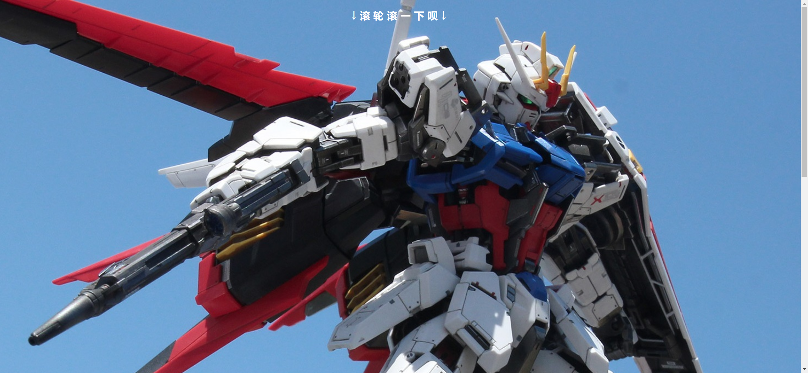
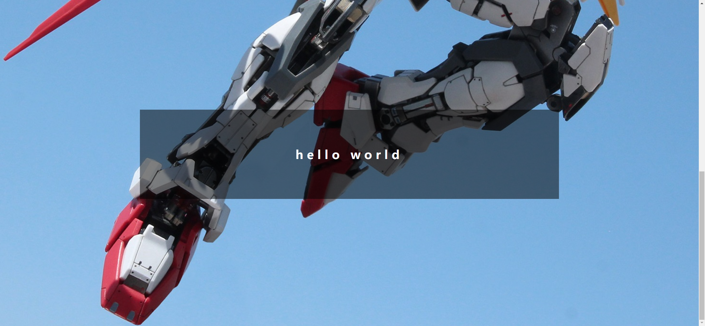

Your task is to design a webpage with a parallax scrolling effect. The webpage should have a background image that moves as the user scrolls down the page. Below are the detailed instructions to help you re-implement the webpage.

### Initial Webpage
The initial webpage should look like this:

### Resources
- **Background Image**: `images/mountain.jpg` is used as the background image for the `.bg` element.
- **Text Content**:
  - The text content for the `<h2>` element is "↓滚轮滚一下呗↓".
  - The text content for the `` element inside the `.bg` div is "Hello".
  - The text content for the `<h1>` element is "hello world".

### Layout and Styling
- **General Styles**:
  - Set the body height to `200vh` to create a two-screen height effect.

- **Background Section**:
  - Use the class name `.bg` for the background section.
  - Set the background image to `images/mountain.jpg`.
  
- **Background Overlay**:
  - Use the `::before` pseudo-element to create an overlay that inherits the background image.
  
- **Header Text**:
  - Use the `<h2>` element for the header text.
  
- **Footer Text**:
  - Use the `<h1>` element for the footer text

### JavaScript Functionality
- **Parallax Scrolling**:
  - Select the `.bg` element using `document.querySelector(".bg")`.
  - Add an event listener for the `scroll` event on the document.
  - Update the background position of the `.bg` element based on the scroll position (`window.scrollY`).

### Interaction
The webpage should have a parallax scrolling effect. When the user scrolls down, the background image should move, creating a dynamic visual effect.

### Screenshots
The provided screenshots are rendered under a resolution of 1920x1080.

- **Initial Webpage**:
  

- **Scrolled Webpage**:
  
