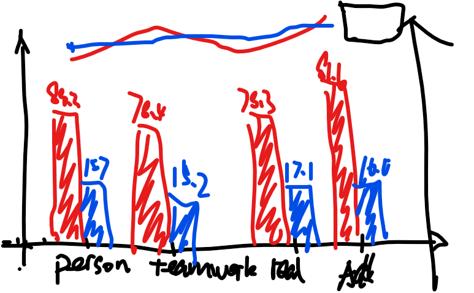

I need you to help me visualize the data as shown in the figure below:



original data is a python dict:

```python
data = {  
    'Personal': {'O_act': 88.264, 'AR_act': 15.652, 'O_reward': 28.303, 'AR_reward': 31.541},  
    'Teamwork': {'O_act': 78.403, 'AR_act': 15.16, 'O_reward': 39.866, 'AR_reward': 37.444},  
    'Real': {'O_act': 78.27, 'AR_act': 17.139, 'O_reward': 29.633, 'AR_reward': 27.271},  
    'All': {'O_act': 81.64, 'AR_act': 15.98, 'O_reward': 32.601, 'AR_reward': 32.085},  
}  
```

1. In the graph, the x-axis is the key of the dictionary, that is, the four values of "Personal", "Teamwork", "Real", and "All", and the bar chart shows the variables of the '_act' property, where the red part is "O_act "and the blue part is the "AR_act". 
2. Above each bar, the specific value of the bar is marked with the corresponding color.
3. A line chart is also drawn above the entire bar chart, again red for "O_reward "and blue for "AR_reward".
4. The y-axis on the left side of the entire chart is the value of the bar chart, while the y-axis on the right represents the value of the line chart.
5. Finally, you also need to display the legend correctly and reasonably.


You can generate python code and draw this visualization using any python library. 