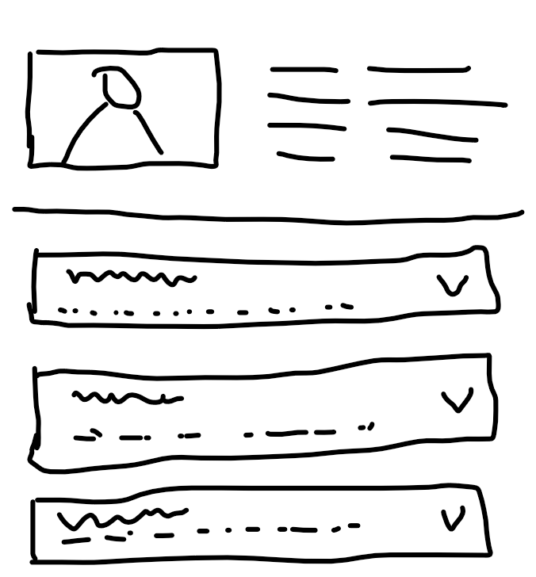
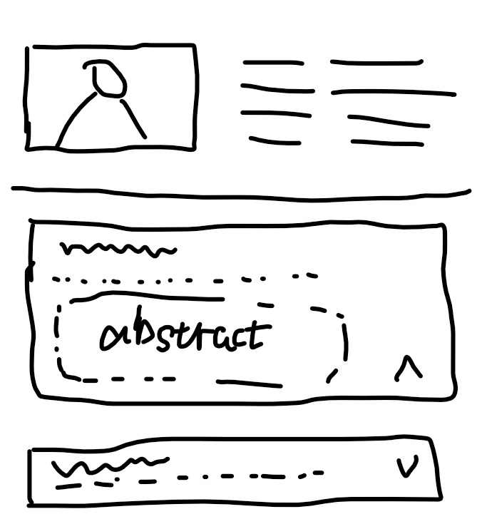

I would like you to help me generate a web page for my academic resume, and I will provide you with the requirements and a draft diagram of the web page.
### Layout description
The webpage should look like this as original webpage:

The top left part is the photo, and its right are same basic information like name, birthday and etc, you can generate several item there. Below is a paper list, you need a separate line between the basic information part and the paper list part as shown in the image. Then, each paper should be in a box. On the right side there is a button that shows the drop-down box. On each box there should be 2 lines, the first line with larger font size shows the paper title and the second line shows the author list.

When user click on the button on the box, it will show the larger box and show the abstract of the paper, it should look like this :

### Resources

we will provide all information for you to generate the webpage:
- photo path: `images/photo.png`

  paper list:

- Title: "How to make American great again";  author: "Donald J.Trump, Vans, Elon R. Musk, Robert Francis Kennedy Jr.";  Abstract: "This paper researched how to make American great again."

- Title: "What should we do to make American great again";  author: "Donald J.Trump, Vans, Elon R. Musk, Robert Francis Kennedy Jr."; Abstract: "This paper researched what should we do to make American great again."

-  Title: "why we should make American great again";  author: "Donald J.Trump, Vans, Elon R. Musk, Robert Francis Kennedy Jr."; Abstract: "This paper researched why we should make American great again."

You are free to design any css attributes and animations to make the webpage looks better. Now, please generate the html code (and css and javascript code if needed).